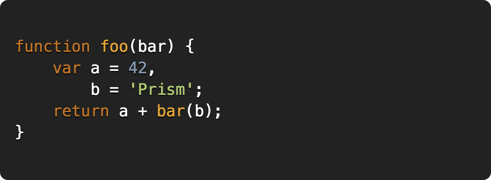
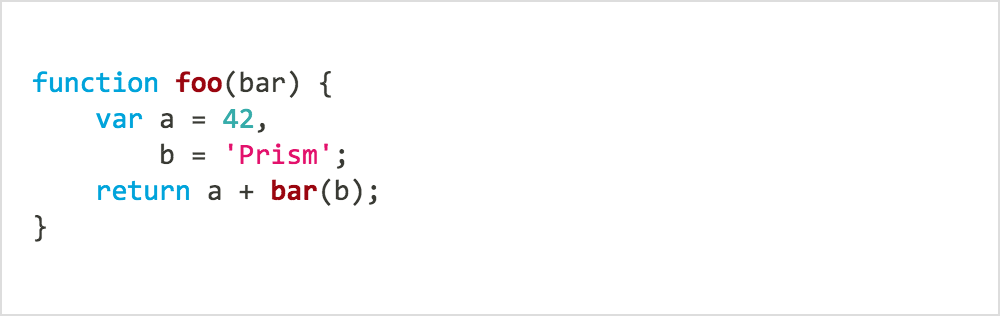

# Prism themes

This repository lists a selection of additional themes for the [Prism syntax highlighting library](http://prismjs.com/).

## How to use a theme

To use one of the themes, just include the theme's CSS file in your page. Example:

```html
<!DOCTYPE html>
<html>
    <head>
        ...
        <link href="themes/prism-ghcolors.css" rel="stylesheet" />
    </head>
    <body>
        ...
        <script src="prism.js"></script>
    </body>
</html>
```

## Available themes

* <p>[__CB__](themes/prism-cb.css) (originally by [C. Bavota](https://bitbucket.org/cbavota), adapted by [atelierbram](https://github.com/atelierbram))<br />
[](themes/prism-cb.css)</p>
* <p>[__GHColors__](themes/prism-ghcolors.css) (by [aviaryan](https://github.com/aviaryan))<br />
[](themes/prism-ghcolors.css)</p>
* <p>[__Pojoaque__](themes/prism-pojoaque.css) (originally by [Jason Tate](http://web-cms-designs.com/ftopict-10-pojoaque-style-for-highlight-js-code-highlighter.html), adapted by [atelierbram](https://github.com/atelierbram))<br />
[](themes/prism-pojoaque.css)</p>
* <p>[__Xonokai__](themes/prism-xonokai.css) (originally by [Maxime Thirouin (MoOx)](https://github.com/MoOx), adapted by [atelierbram](https://github.com/atelierbram))<br />
[](themes/prism-xonokai.css)</p>
* <p>[__Ateliersulphurpool-light__](themes/prism-base16-ateliersulphurpool.light.css) (by [Bram de Haan](https://github.com/atelierbram))<br />
[](themes/prism-base16-ateliersulphurpool.light.css)</p>
* <p>[__Hopscotch__](themes/prism-hopscotch.css) (by [Jan T. Sott](https://github.com/idleberg))<br />
[](themes/prism-hopscotch.css)</p>
* <p>[__Atom Dark__](themes/prism-atom-dark.css) (by [gibsjose](https://github.com/gibsjose), based on [Atom Dark Syntax theme](https://github.com/atom/atom-dark-syntax))<br />
[](themes/prism-atom-dark.css)</p>
* <p>[__Duotone Light](themes/prism-duotone-light.css) (by [Simurai](https://github.com/simurai), based on [DuoTone Light Syntax theme](https://github.com/simurai/duotone-light-syntax))<br />
[](themes/prism-duotone-light.css)</p>
