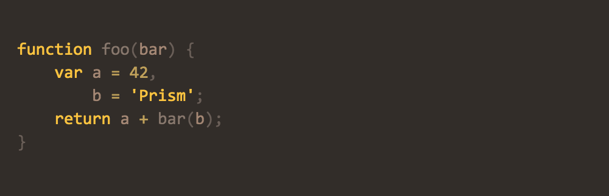
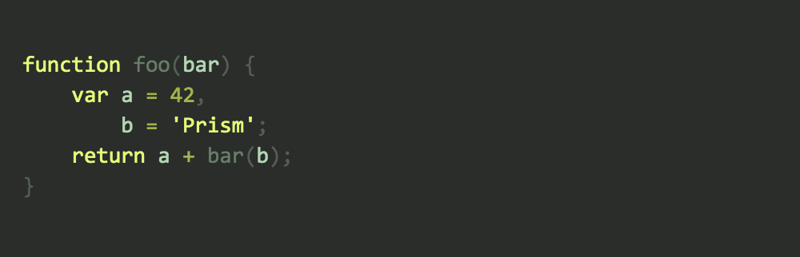
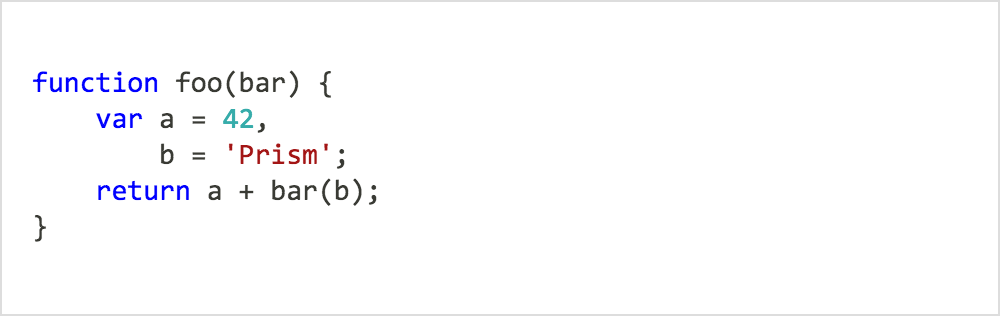
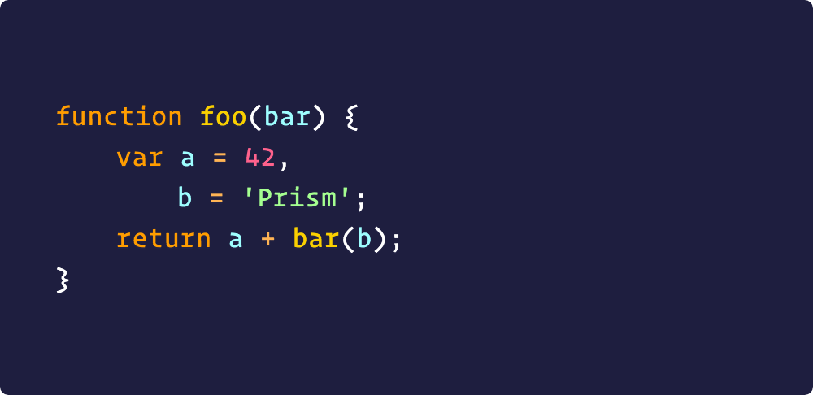

# Prism.js Themes

> A selection of additional themes for the [Prism syntax highlighting library](http://prismjs.com/).

## How to use a theme

To use one of the themes, include a theme's `css` file (present in the [themes directory](themes)) in your page. For example:

```html
<!DOCTYPE html>
<html>
	<head>
		...
		<!-- <link href="prism-[theme-name-here].css" rel="stylesheet" /> -->
		<link href="prism-shades-of-purple.css" rel="stylesheet" />
	</head>
	<body>
		...
		<script src="prism.js"></script>
	</body>
</html>
```

## Available Themes

## 🎨 [**CB**](themes/prism-cb.css)

> Originally by [C. Bavota](https://bitbucket.org/cbavota), adapted by [atelierbram](https://github.com/atelierbram)

[](themes/prism-cb.css)

```html
<link href="prism-cb.css" rel="stylesheet" />
```

## 🎨 [**GHColors**](themes/prism-ghcolors.css)

> By [aviaryan](https://github.com/aviaryan)

[](themes/prism-ghcolors.css)

```html
<link href="prism-ghcolors.css" rel="stylesheet" />
```

## 🎨 [**Pojoaque**](themes/prism-pojoaque.css)

> Originally by [Jason Tate](http://web-cms-designs.com/ftopict-10-pojoaque-style-for-highlight-js-code-highlighter.html), adapted by [atelierbram](https://github.com/atelierbram)

[](themes/prism-pojoaque.css)

```html
<link href="prism-pojoaque.css" rel="stylesheet" />
```

## 🎨 [**Xonokai**](themes/prism-xonokai.css)

> Originally by [Maxime Thirouin (MoOx)](https://github.com/MoOx), adapted by [atelierbram](https://github.com/atelierbram)

[](themes/prism-xonokai.css)

```html
<link href="prism-xonokai.css" rel="stylesheet" />
```

## 🎨 [**Ateliersulphurpool-light**](themes/prism-base16-ateliersulphurpool.light.css)

> By [Bram de Haan](https://github.com/atelierbram)

[](themes/prism-base16-ateliersulphurpool.light.css)

```html
<link href="prism-base16-ateliersulphurpool.light.css" rel="stylesheet" />
```

## 🎨 [**Hopscotch**](themes/prism-hopscotch.css)

> By [Jan T. Sott](https://github.com/idleberg)

[](themes/prism-hopscotch.css)

```html
<link href="prism-hopscotch.css" rel="stylesheet" />
```

## 🎨 [**Atom Dark**](themes/prism-atom-dark.css)

> By [gibsjose](https://github.com/gibsjose), based on [Atom Dark Syntax theme](https://github.com/atom/atom-dark-syntax)

[](themes/prism-atom-dark.css)

```html
<link href="prism-atom-dark.css" rel="stylesheet" />
```

## 🎨 [**Duotone Dark**](themes/prism-duotone-dark.css)

> By [Simurai](https://github.com/simurai), based on [Duotone Dark Syntax theme for Atom](https://github.com/simurai/duotone-dark-syntax)

[](themes/prism-duotone-dark.css)

```html
<link href="prism-duotone-dark.css" rel="stylesheet" />
```

## 🎨 [**Duotone Sea**](themes/prism-duotone-sea.css)

> By [Simurai](https://github.com/simurai), based on [DuoTone Dark Sea Syntax theme for Atom](https://github.com/simurai/duotone-dark-sea-syntax)

[](themes/prism-duotone-sea.css)

```html
<link href="prism-duotone-sea.css" rel="stylesheet" />
```

## 🎨 [**Duotone Space**](themes/prism-duotone-space.css)

> By [Simurai](https://github.com/simurai), based on [DuoTone Dark Space Syntax theme for Atom](https://github.com/simurai/duotone-dark-space-syntax)

[](themes/prism-duotone-space.css)

```html
<link href="prism-duotone-space.css" rel="stylesheet" />
```

## 🎨 [**Duotone Earth**](themes/prism-duotone-earth.css)

> By [Simurai](https://github.com/simurai), based on [DuoTone Dark Earth Syntax theme for Atom](https://github.com/simurai/duotone-dark-earth-syntax)

[](themes/prism-duotone-earth.css)

```html
<link href="prism-duotone-earth.css" rel="stylesheet" />
```

## 🎨 [**Duotone Forest**](themes/prism-duotone-forest.css)

> By [Simurai](https://github.com/simurai), based on [DuoTone Dark Forest Syntax theme for Atom](https://github.com/simurai/duotone-dark-forest-syntax)

[](themes/prism-duotone-forest.css)

```html
<link href="prism-duotone-forest.css" rel="stylesheet" />
```

## 🎨 [prism-duotone-forest.css](themes/prism-duotone-light.css)

> By [Simurai](https://github.com/simurai), based on [DuoTone Light Syntax theme](https://github.com/simurai/duotone-light-syntax)

[](themes/prism-duotone-light.css)

```html
<link href="prism-duotone-light.css" rel="stylesheet" />
```

## 🎨 [**VS**](themes/prism-vs.css)

> By [andrewlock](https://github.com/andrewlock)

[](themes/prism-vs.css)

```html
<link href="prism-vs.css" rel="stylesheet" />
```

## 🎨 [**Darcula**](themes/prism-darcula.css)

> By [service-paradis](https://github.com/service-paradis), based on Jetbrains Darcula theme)

[](themes/prism-darcula.css)

```html
<link href="prism-darcula.css" rel="stylesheet" />
```

## 🎨 [**a11y Dark**](themes/prism-a11y-dark.css)

> By [ericwbailey](https://github.com/ericwbailey)

[](themes/prism-a11y-dark.css)

```html
<link href="prism-a11y-dark.css" rel="stylesheet" />
```

## 🎨 [**Dracula**](themes/prism-dracula.css)

> By [Byverdu](https://github.com/byverdu)

[](themes/prism-dracula.css)

```html
<link href="prism-dracula.css" rel="stylesheet" />
```

## 🎨 [**Synthwave '84**](themes/prism-synthwave84.css)

> Originally by [Robb Owen](https://github.com/robb0wen), adapted by [Marc Backes](https://github.com/themarcba)

[](themes/prism-synthwave84.css)

```html
<link href="prism-synthwave84.css" rel="stylesheet" />
```

## 🎨 [**Shades of Purple**](themes/prism-shades-of-purple.css)

> By [Ahmad Awais](https://github.com/ahmadawais)

[](themes/prism-shades-of-purple.css)

```html
<link href="prism-shades-of-purple.css" rel="stylesheet" />
```
