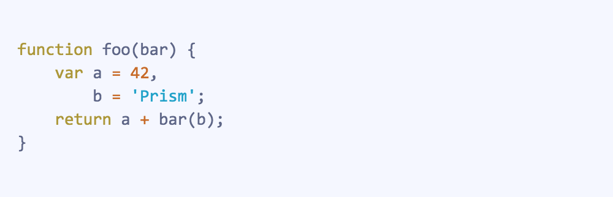
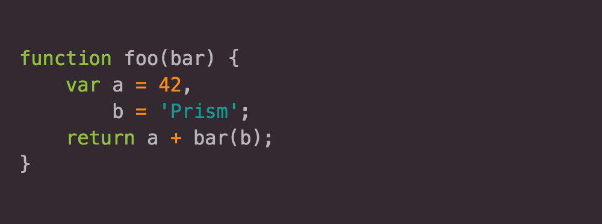
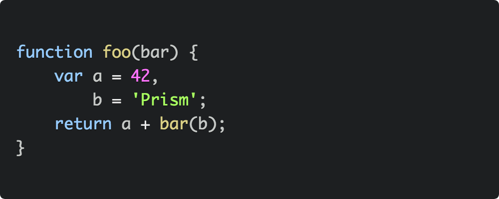
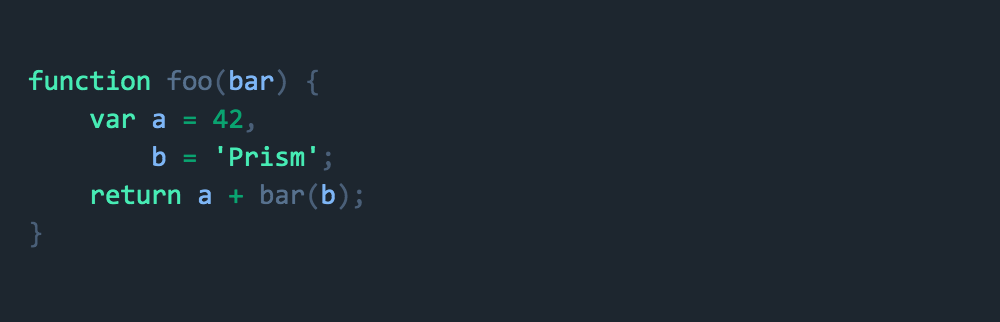
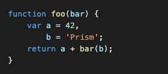
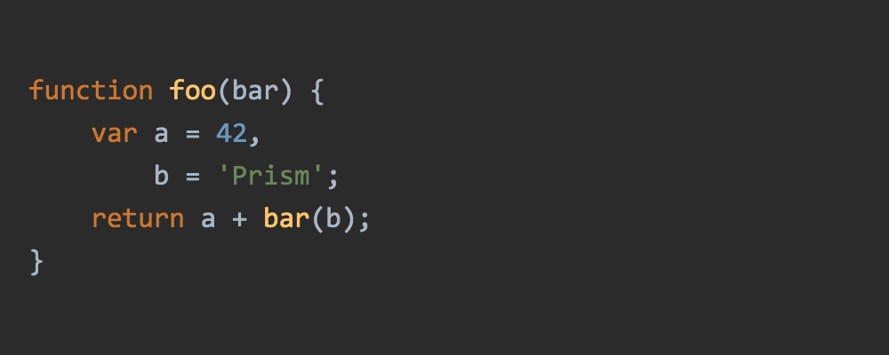
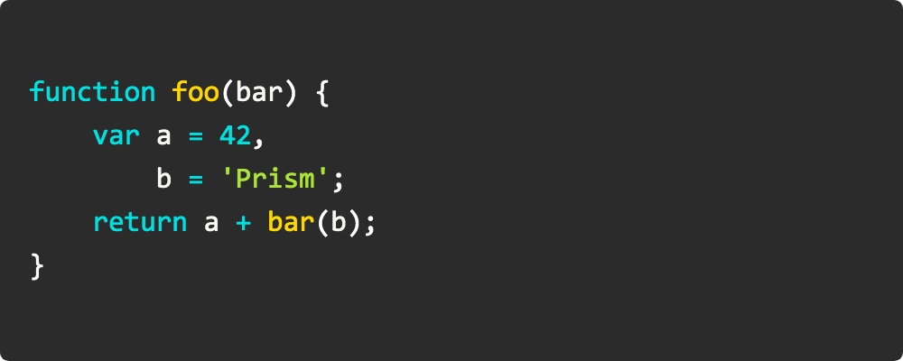
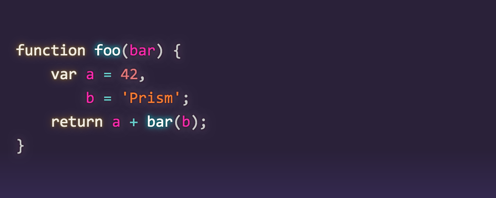
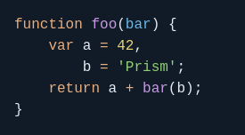

# Prism themes

[](https://github.com/PrismJS/prism-themes/actions)
[](https://www.npmjs.com/package/prism-themes)

This repository lists a selection of additional themes for the [Prism syntax highlighting library](http://prismjs.com/).

## How to use a theme

To use one of the themes, just include the theme's CSS file in your page. Example:

```html
<!DOCTYPE html>
<html>
  <head>
    ...
    <link href="themes/prism-ghcolors.css" rel="stylesheet" />
  </head>
  <body>
    ...
    <script src="prism.js"></script>
  </body>
</html>
```

## Adding a New Theme

To add your own theme, copy it into the `themes` directory and add your themes to the list of available themes in the readme.
The links for your themes have to be `themes/prism-<your theme>.css` for the theme itself and `screenshots/prism-<your theme>.png` for the screenshot.

The screenshot will be created for you by running the following command:

```bash
npm i && npx gulp screenshot
```

Before making a pull request, you can the following command to verify that all checks pass:

```bash
npm test
```

Thank you so much for contributing!!

## Available themes

- [**CB**](themes/prism-cb.css) (originally by [C. Bavota](https://bitbucket.org/cbavota), adapted by [atelierbram](https://github.com/atelierbram))<br />
  [](themes/prism-cb.css)

- [**GHColors**](themes/prism-ghcolors.css) (by [aviaryan](https://github.com/aviaryan))<br />
  [](themes/prism-ghcolors.css)

- [**Pojoaque**](themes/prism-pojoaque.css) (originally by [Jason Tate](http://web-cms-designs.com/ftopict-10-pojoaque-style-for-highlight-js-code-highlighter.html), adapted by [atelierbram](https://github.com/atelierbram))<br />
  [](themes/prism-pojoaque.css)

- [**Xonokai**](themes/prism-xonokai.css) (originally by [Maxime Thirouin (MoOx)](https://github.com/MoOx), adapted by [atelierbram](https://github.com/atelierbram))<br />
  [](themes/prism-xonokai.css)

- [**Ateliersulphurpool-light**](themes/prism-base16-ateliersulphurpool.light.css) (by [Bram de Haan](https://github.com/atelierbram))<br />
  [](themes/prism-base16-ateliersulphurpool.light.css)

- [**Hopscotch**](themes/prism-hopscotch.css) (by [Jan T. Sott](https://github.com/idleberg))<br />
  [](themes/prism-hopscotch.css)

- [**Atom Dark**](themes/prism-atom-dark.css) (by [gibsjose](https://github.com/gibsjose), based on [Atom Dark Syntax theme](https://github.com/atom/atom-dark-syntax))<br />
  [](themes/prism-atom-dark.css)

- [**Duotone Dark**](themes/prism-duotone-dark.css) (by [Simurai](https://github.com/simurai), based on [Duotone Dark Syntax theme for Atom](https://github.com/simurai/duotone-dark-syntax))<br />
  [](themes/prism-duotone-dark.css)

- [**Duotone Sea**](themes/prism-duotone-sea.css) (by [Simurai](https://github.com/simurai), based on [DuoTone Dark Sea Syntax theme for Atom](https://github.com/simurai/duotone-dark-sea-syntax))<br />
  [](themes/prism-duotone-sea.css)

- [**Duotone Space**](themes/prism-duotone-space.css) (by [Simurai](https://github.com/simurai), based on [DuoTone Dark Space Syntax theme for Atom](https://github.com/simurai/duotone-dark-space-syntax))<br />
  [](themes/prism-duotone-space.css)

- [**Duotone Earth**](themes/prism-duotone-earth.css) (by [Simurai](https://github.com/simurai), based on [DuoTone Dark Earth Syntax theme for Atom](https://github.com/simurai/duotone-dark-earth-syntax))<br />
  [](themes/prism-duotone-earth.css)

- [**Duotone Forest**](themes/prism-duotone-forest.css) (by [Simurai](https://github.com/simurai), based on [DuoTone Dark Forest Syntax theme for Atom](https://github.com/simurai/duotone-dark-forest-syntax))<br />
  [](themes/prism-duotone-forest.css)

- [**Duotone Light**](themes/prism-duotone-light.css) (by [Simurai](https://github.com/simurai), based on [DuoTone Light Syntax theme](https://github.com/simurai/duotone-light-syntax))<br />
  [](themes/prism-duotone-light.css)

- [**VS**](themes/prism-vs.css) (by [andrewlock](https://github.com/andrewlock))<br />
  [](themes/prism-vs.css)

- [**VS Code Dark+**](themes/prism-vsc-dark-plus.css) (by [tabuckner](https://github.com/tabuckner))<br />
  [](themes/prism-vsc-dark-plus.css)

- [**Darcula**](themes/prism-darcula.css) (by [service-paradis](https://github.com/service-paradis), based on Jetbrains Darcula theme)<br />
  [](themes/prism-darcula.css)

- [**a11y Dark**](themes/prism-a11y-dark.css) (by [ericwbailey](https://github.com/ericwbailey))<br />
  [](themes/prism-a11y-dark.css)

- [**Dracula**](themes/prism-dracula.css) (by [Byverdu](https://github.com/byverdu))<br />
  [](themes/prism-dracula.css)

- [**Synthwave '84**](themes/prism-synthwave84.css) (originally by [Robb Owen](https://github.com/robb0wen), adapted by [Marc Backes](https://github.com/themarcba))<br />
  [](themes/prism-synthwave84.css)

- [**Shades of Purple**](themes/prism-shades-of-purple.css) (by [Ahmad Awais](https://github.com/ahmadawais))<br />
  [](themes/prism-shades-of-purple.css)

- [**Material Dark**](themes/prism-material-dark.css) (by [dutchenkoOleg](https://github.com/dutchenkoOleg))<br />
  [](themes/prism-material-dark.css)

- [**Material Light**](themes/prism-material-light.css) (by [dutchenkoOleg](https://github.com/dutchenkoOleg))<br />
  [](themes/prism-material-light.css)

- [**Material Oceanic**](themes/prism-material-oceanic.css) (by [dutchenkoOleg](https://github.com/dutchenkoOleg))<br />
  [](themes/prism-material-oceanic.css)

- [**Nord**](themes/prism-nord.css) (originally by [Nord](https://www.nordtheme.com/), adapted by [Zane Hitchcox](https://github.com/zwhitchcox) and [Gabriel Ramos](https://github.com/gabrieluizramos))<br />
  [](themes/prism-nord.css)

- [**Coldark Cold**](themes/prism-coldark-cold.css) (by [Armand Philippot](https://github.com/ArmandPhilippot), based on [Coldark](https://github.com/ArmandPhilippot/coldark))<br />
  [](themes/prism-coldark-cold.css)

- [**Coldark Dark**](themes/prism-coldark-dark.css) (by [Armand Philippot](https://github.com/ArmandPhilippot), based on [Coldark](https://github.com/ArmandPhilippot/coldark))<br />
  [](themes/prism-coldark-dark.css)

- [**Coy without shadows**](themes/prism-coy-without-shadows.css) (by [RunDevelopment](https://github.com/RunDevelopment), based on Tim Shedor's Coy theme)<br />
  [](themes/prism-coy-without-shadows.css)

- [**Gruvbox Dark**](themes/prism-gruvbox-dark.css) (by [Azat S.](https://github.com/azat-io))<br />
  [](themes/prism-gruvbox-dark.css)

- [**Lucario**](themes/prism-lucario.css) (by [Christopher Kapic](https://github.com/christopher-kapic), based on [Raphael Amorim's](https://github.com/raphamorim) [Lucario Theme](https://github.com/raphamorim/lucario))<br />
  [](themes/prism-lucario.png)

- [**Night Owl**](themes/prism-night-owl.css) (by [Souvik Mandal](https://github.com/souvik362), based on [Sarah Drasner's](https://github.com/sdras) [Night owl Theme](https://github.com/sdras/night-owl-vscode-theme))<br />
  [](themes/prism-night-owl.png)
