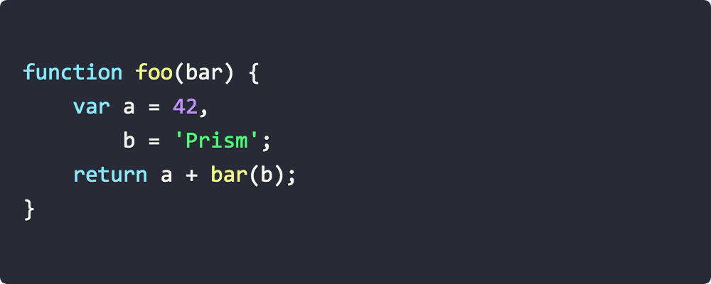
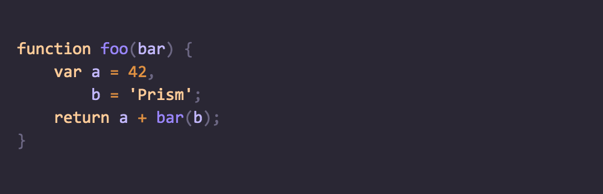
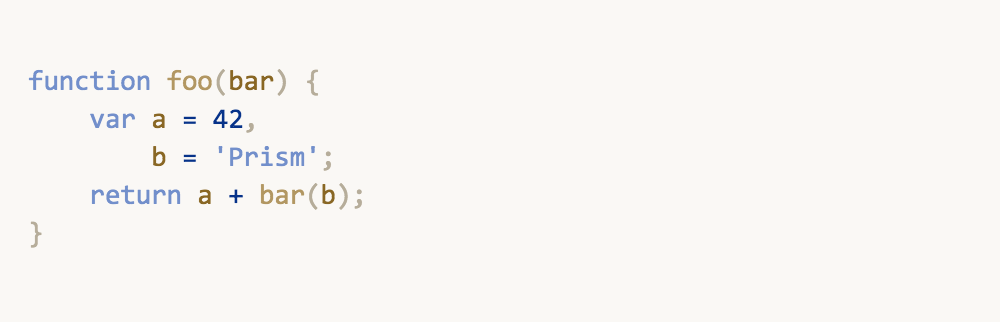
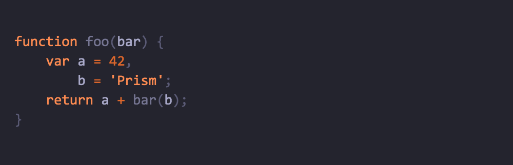
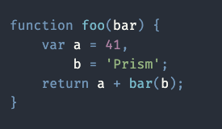
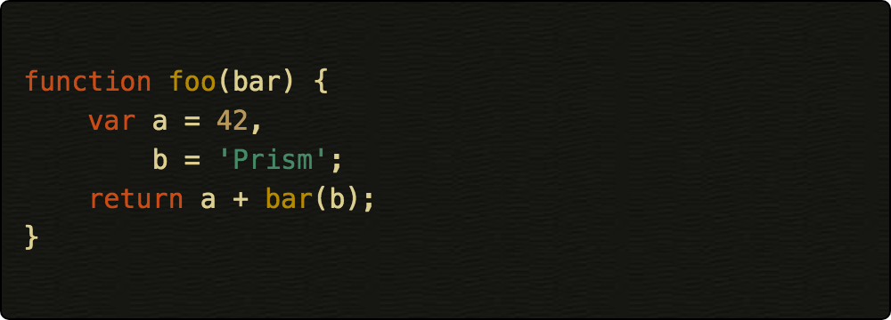
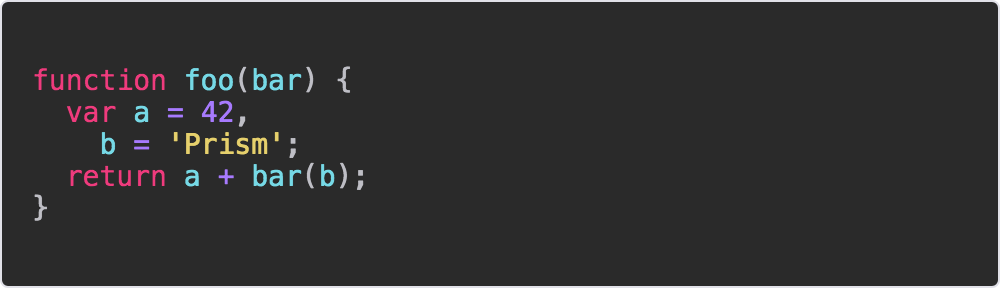

# Prism themes

[](https://github.com/PrismJS/prism-themes/actions)
[](https://www.npmjs.com/package/prism-themes)

This repository lists a selection of additional themes for the [Prism syntax highlighting library](http://prismjs.com/).

## How to use a theme

To use one of the themes, just include the theme's CSS file in your page. Example:

```html
<!DOCTYPE html>
<html>
    <head>
        ...
        <link href="themes/prism-ghcolors.css" rel="stylesheet" />
    </head>
    <body>
        ...
        <script src="prism.js"></script>
    </body>
</html>
```

## Contributing new themes

Please see our [Contributing guide](CONTRIBUTING.md) for details. Thank you for contributing!!

## Available themes

* [__a11y Dark__](themes/prism-a11y-dark.css) (CDN: [https://cdnjs.cloudflare.com/ajax/libs/prism-themes/1.9.0/prism-a11y-dark.min.css](https://cdnjs.cloudflare.com/ajax/libs/prism-themes/1.9.0/prism-a11y-dark.min.css))<br />
[](themes/prism-a11y-dark.css)

```html
<link rel="stylesheet" href="https://cdnjs.cloudflare.com/ajax/libs/prism-themes/1.9.0/prism-a11y-dark.min.css" integrity="" crossorigin="anonymous" referrerpolicy="no-referrer" />
```
<br />

* [__Atom Dark__](themes/prism-atom-dark.css) (CDN: [https://cdnjs.cloudflare.com/ajax/libs/prism-themes/1.9.0/prism-atom-dark.min.css](https://cdnjs.cloudflare.com/ajax/libs/prism-themes/1.9.0/prism-atom-dark.min.css))<br />
[](themes/prism-atom-dark.css)
```html
<link rel="stylesheet" href="https://cdnjs.cloudflare.com/ajax/libs/prism-themes/1.9.0/prism-atom-dark.min.css" integrity="" crossorigin="anonymous" referrerpolicy="no-referrer" />
```
<br />

* [__CB__](themes/prism-cb.css) (CDN: [https://cdnjs.cloudflare.com/ajax/libs/prism-themes/1.9.0/prism-cb.min.css](https://cdnjs.cloudflare.com/ajax/libs/prism-themes/1.9.0/prism-cb.min.css))<br />
[](themes/prism-cb.css)
```html
<link rel="stylesheet" href="https://cdnjs.cloudflare.com/ajax/libs/prism-themes/1.9.0/prism-cb.min.css" integrity="" crossorigin="anonymous" referrerpolicy="no-referrer" />
```
<br />

* [__Coldark Cold__](themes/prism-coldark-cold.css) (CDN: [https://cdnjs.cloudflare.com/ajax/libs/prism-themes/1.9.0/prism-coldark-cold.min.css](https://cdnjs.cloudflare.com/ajax/libs/prism-themes/1.9.0/prism-coldark-cold.min.css))<br />
[](themes/prism-coldark-cold.css)
```html
<link rel="stylesheet" href="https://cdnjs.cloudflare.com/ajax/libs/prism-themes/1.9.0/prism-coldark-cold.min.css" integrity="" crossorigin="anonymous" referrerpolicy="no-referrer" />
```
<br />

* [__Coldark Dark__](themes/prism-coldark-dark.css) (CDN: [https://cdnjs.cloudflare.com/ajax/libs/prism-themes/1.9.0/prism-coldark-dark.min.css](https://cdnjs.cloudflare.com/ajax/libs/prism-themes/1.9.0/prism-coldark-dark.min.css))<br />
[](themes/prism-coldark-dark.css)
```html
<link rel="stylesheet" href="https://cdnjs.cloudflare.com/ajax/libs/prism-themes/1.9.0/prism-coldark-dark.min.css" integrity="" crossorigin="anonymous" referrerpolicy="no-referrer" />
```
<br />

* [__Coy without shadows__](themes/prism-coy-without-shadows.css) (CDN: [https://cdnjs.cloudflare.com/ajax/libs/prism-themes/1.9.0/prism-coy-without-shadows.min.css](https://cdnjs.cloudflare.com/ajax/libs/prism-themes/1.9.0/prism-coy-without-shadows.min.css))<br />
[](themes/prism-coy-without-shadows.css)
```html
<link rel="stylesheet" href="https://cdnjs.cloudflare.com/ajax/libs/prism-themes/1.9.0/prism-coy-without-shadows.min.css" integrity="" crossorigin="anonymous" referrerpolicy="no-referrer" />
```
<br />

* [__Darcula__](themes/prism-darcula.css) (CDN: [https://cdnjs.cloudflare.com/ajax/libs/prism-themes/1.9.0/prism-darcula.min.css](https://cdnjs.cloudflare.com/ajax/libs/prism-themes/1.9.0/prism-darcula.min.css))<br />
[](themes/prism-dracula.css)
```html
<link rel="stylesheet" href="https://cdnjs.cloudflare.com/ajax/libs/prism-themes/1.9.0/prism-darcula.min.css" integrity="" crossorigin="anonymous" referrerpolicy="no-referrer" />
```
<br />

* [__Duotone Dark__](themes/prism-duotone-dark.css) (CDN: [https://cdnjs.cloudflare.com/ajax/libs/prism-themes/1.9.0/prism-duotone-dark.min.css](https://cdnjs.cloudflare.com/ajax/libs/prism-themes/1.9.0/prism-duotone-dark.min.css))<br />
[](themes/prism-duotone-dark.css)
```html
<link rel="stylesheet" href="https://cdnjs.cloudflare.com/ajax/libs/prism-themes/1.9.0/prism-duotone-dark.min.css" integrity="" crossorigin="anonymous" referrerpolicy="no-referrer" />
```
<br />

* [__Duotone Earth__](themes/prism-duotone-earth.css) (CDN: [https://cdnjs.cloudflare.com/ajax/libs/prism-themes/1.9.0/prism-duotone-earth.min.css](https://cdnjs.cloudflare.com/ajax/libs/prism-themes/1.9.0/prism-duotone-earth.min.css))<br />
[](themes/prism-duotone-earth.css)
```html
<link rel="stylesheet" href="https://cdnjs.cloudflare.com/ajax/libs/prism-themes/1.9.0/prism-duotone-earth.min.css" integrity="" crossorigin="anonymous" referrerpolicy="no-referrer" />
```
<br />

* [__Duotone Forest__](themes/prism-duotone-forest.css) (CDN: [https://cdnjs.cloudflare.com/ajax/libs/prism-themes/1.9.0/prism-duotone-forest.min.css](https://cdnjs.cloudflare.com/ajax/libs/prism-themes/1.9.0/prism-duotone-forest.min.css))<br />
[](themes/prism-duotone-forest.css)
```html
<link rel="stylesheet" href="https://cdnjs.cloudflare.com/ajax/libs/prism-themes/1.9.0/prism-duotone-forest.min.css" integrity="" crossorigin="anonymous" referrerpolicy="no-referrer" />
```
<br />

* [__Duotone Light__](themes/prism-duotone-light.css) (CDN: [https://cdnjs.cloudflare.com/ajax/libs/prism-themes/1.9.0/prism-duotone-light.min.css](https://cdnjs.cloudflare.com/ajax/libs/prism-themes/1.9.0/prism-duotone-light.min.css))<br />
[](themes/prism-duotone-light.css)
```html
<link rel="stylesheet" href="https://cdnjs.cloudflare.com/ajax/libs/prism-themes/1.9.0/prism-duotone-light.min.css" integrity="" crossorigin="anonymous" referrerpolicy="no-referrer" />
```
<br />

* [__Duotone Sea__](themes/prism-duotone-sea.css) (CDN: [https://cdnjs.cloudflare.com/ajax/libs/prism-themes/1.9.0/prism-duotone-sea.min.css](https://cdnjs.cloudflare.com/ajax/libs/prism-themes/1.9.0/prism-duotone-sea.min.css))<br />
[](themes/prism-duotone-sea.css)
```html
<link rel="stylesheet" href="https://cdnjs.cloudflare.com/ajax/libs/prism-themes/1.9.0/prism-duotone-sea.min.css" integrity="" crossorigin="anonymous" referrerpolicy="no-referrer" />
```
<br />

* [__Duotone Space__](themes/prism-duotone-space.css) (CDN: [https://cdnjs.cloudflare.com/ajax/libs/prism-themes/1.9.0/prism-duotone-space.min.css](https://cdnjs.cloudflare.com/ajax/libs/prism-themes/1.9.0/prism-duotone-space.min.css))<br />
[](themes/prism-duotone-space.css)
```html
<link rel="stylesheet" href="https://cdnjs.cloudflare.com/ajax/libs/prism-themes/1.9.0/prism-duotone-space.min.css" integrity="" crossorigin="anonymous" referrerpolicy="no-referrer" />
```
<br />

* [__GHColors__](themes/prism-ghcolors.css) (CDN: [https://cdnjs.cloudflare.com/ajax/libs/prism-themes/1.9.0/prism-ghcolors.min.css](https://cdnjs.cloudflare.com/ajax/libs/prism-themes/1.9.0/prism-ghcolors.min.css))<br />
[](themes/prism-ghcolors.css)
```html
<link rel="stylesheet" href="https://cdnjs.cloudflare.com/ajax/libs/prism-themes/1.9.0/prism-ghcolors.min.css" integrity="" crossorigin="anonymous" referrerpolicy="no-referrer" />
```
<br />

* [__Gruvbox Dark__](themes/prism-gruvbox-dark.css) (CDN: [https://cdnjs.cloudflare.com/ajax/libs/prism-themes/1.9.0/prism-gruvbox-dark.min.css](https://cdnjs.cloudflare.com/ajax/libs/prism-themes/1.9.0/prism-gruvbox-dark.min.css))<br />
[](themes/prism-gruvbox-dark.css)
```html
<link rel="stylesheet" href="https://cdnjs.cloudflare.com/ajax/libs/prism-themes/1.9.0/prism-gruvbox-dark.min.css" integrity="" crossorigin="anonymous" referrerpolicy="no-referrer" />
```
<br />

* [__Gruvbox Light__](themes/prism-gruvbox-light.css) (CDN: [https://cdnjs.cloudflare.com/ajax/libs/prism-themes/1.9.0/prism-gruvbox-light.min.css](https://cdnjs.cloudflare.com/ajax/libs/prism-themes/1.9.0/prism-gruvbox-light.min.css))<br />
[](themes/prism-gruvbox-light.css)
```html
<link rel="stylesheet" href="https://cdnjs.cloudflare.com/ajax/libs/prism-themes/1.9.0/prism-gruvbox-light.min.css" integrity="" crossorigin="anonymous" referrerpolicy="no-referrer" />
```
<br />

* [__Holi Theme__](themes/prism-holi-theme.css) (CDN: [https://cdnjs.cloudflare.com/ajax/libs/prism-themes/1.9.0/prism-holi-theme.min.css](https://cdnjs.cloudflare.com/ajax/libs/prism-themes/1.9.0/prism-holi-theme.min.css))<br />
[](themes/prism-holi-theme.css)
```html
<link rel="stylesheet" href="https://cdnjs.cloudflare.com/ajax/libs/prism-themes/1.9.0/prism-holi-theme.min.css" integrity="" crossorigin="anonymous" referrerpolicy="no-referrer" />
```
<br />

* [__Hopscotch__](themes/prism-hopscotch.css) (CDN: [https://cdnjs.cloudflare.com/ajax/libs/prism-themes/1.9.0/prism-hopscotch.min.css](https://cdnjs.cloudflare.com/ajax/libs/prism-themes/1.9.0/prism-hopscotch.min.css))<br />
[](themes/prism-hopscotch.css)
```html
<link rel="stylesheet" href="https://cdnjs.cloudflare.com/ajax/libs/prism-themes/1.9.0/prism-hopscotch.min.css" integrity="" crossorigin="anonymous" referrerpolicy="no-referrer" />
```
<br />

* [__Lucario__](themes/prism-lucario.css) (CDN: [https://cdnjs.cloudflare.com/ajax/libs/prism-themes/1.9.0/prism-lucario.min.css](https://cdnjs.cloudflare.com/ajax/libs/prism-themes/1.9.0/prism-lucario.min.css))<br />
[](themes/prism-lucario.css)
```html
<link rel="stylesheet" href="https://cdnjs.cloudflare.com/ajax/libs/prism-themes/1.9.0/prism-lucario.min.css" integrity="" crossorigin="anonymous" referrerpolicy="no-referrer" />
```
<br />

* [__Material Dark__](themes/prism-material-dark.css) (CDN: [https://cdnjs.cloudflare.com/ajax/libs/prism-themes/1.9.0/prism-material-dark.min.css](https://cdnjs.cloudflare.com/ajax/libs/prism-themes/1.9.0/prism-material-dark.min.css))<br />
](themes/prism-material-dark.css)
```html
<link rel="stylesheet" href="https://cdnjs.cloudflare.com/ajax/libs/prism-themes/1.9.0/prism-material-dark.min.css" integrity="" crossorigin="anonymous" referrerpolicy="no-referrer" />
```
<br />

* [__Material Light__](themes/prism-material-light.css) (CDN: [https://cdnjs.cloudflare.com/ajax/libs/prism-themes/1.9.0/prism-material-light.min.css](https://cdnjs.cloudflare.com/ajax/libs/prism-themes/1.9.0/prism-material-light.min.css))<br />
[](themes/prism-material-light.css)
```html
<link rel="stylesheet" href="https://cdnjs.cloudflare.com/ajax/libs/prism-themes/1.9.0/prism-material-light.min.css" integrity="" crossorigin="anonymous" referrerpolicy="no-referrer" />
```
<br />


* [__Material Oceanic__](themes/prism-material-oceanic.css) (CDN: [https://cdnjs.cloudflare.com/ajax/libs/prism-themes/1.9.0/prism-material-oceanic.min.css](https://cdnjs.cloudflare.com/ajax/libs/prism-themes/1.9.0/prism-material-oceanic.min.css))<br />
[](themes/prism-material-oceanic.css)
```html
<link rel="stylesheet" href="https://cdnjs.cloudflare.com/ajax/libs/prism-themes/1.9.0/prism-material-oceanic.min.css" integrity="" crossorigin="anonymous" referrerpolicy="no-referrer" />
```
<br />

* [__Night Owl__](themes/prism-night-owl.css) (CDN: [https://cdnjs.cloudflare.com/ajax/libs/prism-themes/1.9.0/prism-night-owl.min.css](https://cdnjs.cloudflare.com/ajax/libs/prism-themes/1.9.0/prism-night-owl.min.css))<br />
[](themes/prism-night-owl.css)
```html
<link rel="stylesheet" href="https://cdnjs.cloudflare.com/ajax/libs/prism-themes/1.9.0/prism-night-owl.min.css" integrity="" crossorigin="anonymous" referrerpolicy="no-referrer" />
```
<br />

* [__Nord__](themes/prism-nord.css) (CDN: [https://cdnjs.cloudflare.com/ajax/libs/prism-themes/1.9.0/prism-nord.min.css](https://cdnjs.cloudflare.com/ajax/libs/prism-themes/1.9.0/prism-nord.min.css))<br />
[](themes/prism-nord.css)
```html
<link rel="stylesheet" href="https://cdnjs.cloudflare.com/ajax/libs/prism-themes/1.9.0/prism-nord.min.css" integrity="" crossorigin="anonymous" referrerpolicy="no-referrer" />
```
<br />

* [__One Dark__](themes/prism-one-dark.css) (CDN: [https://cdnjs.cloudflare.com/ajax/libs/prism-themes/1.9.0/prism-one-dark.min.css](https://cdnjs.cloudflare.com/ajax/libs/prism-themes/1.9.0/prism-one-dark.min.css))<br />
[](themes/prism-one-dark.css)
```html
<link rel="stylesheet" href="https://cdnjs.cloudflare.com/ajax/libs/prism-themes/1.9.0/prism-one-dark.min.css" integrity="" crossorigin="anonymous" referrerpolicy="no-referrer" />
```
<br />

* [__One Light__](themes/prism-one-light.css) (CDN: [https://cdnjs.cloudflare.com/ajax/libs/prism-themes/1.9.0/prism-one-light.min.css](https://cdnjs.cloudflare.com/ajax/libs/prism-themes/1.9.0/prism-one-light.min.css))<br />
[](themes/prism-one-light.css)
```html
<link rel="stylesheet" href="https://cdnjs.cloudflare.com/ajax/libs/prism-themes/1.9.0/prism-one-light.min.css" integrity="" crossorigin="anonymous" referrerpolicy="no-referrer" />
```
<br />

* [__Pojoaque__](themes/prism-pojoaque.css) (CDN: [https://cdnjs.cloudflare.com/ajax/libs/prism-themes/1.9.0/prism-pojoaque.min.css](https://cdnjs.cloudflare.com/ajax/libs/prism-themes/1.9.0/prism-pojoaque.min.css))<br />
[](themes/prism-pojoaque.css)
```html
<link rel="stylesheet" href="https://cdnjs.cloudflare.com/ajax/libs/prism-themes/1.9.0/prism-pojoaque.min.css" integrity="" crossorigin="anonymous" referrerpolicy="no-referrer" />
```
<br />

* [__Shades of Purple__](themes/prism-shades-of-purple.css) (CDN: [https://cdnjs.cloudflare.com/ajax/libs/prism-themes/1.9.0/prism-shades-of-purple.min.css](https://cdnjs.cloudflare.com/ajax/libs/prism-themes/1.9.0/prism-shades-of-purple.min.css))<br />
[](themes/prism-shades-of-purple.css)
```html
<link rel="stylesheet" href="https://cdnjs.cloudflare.com/ajax/libs/prism-themes/1.9.0/prism-shades-of-purple.min.css" integrity="" crossorigin="anonymous" referrerpolicy="no-referrer" />
```
<br />

* [__Solarized Dark Atom__](themes/prism-solarized-dark-atom.css) (CDN: [https://cdnjs.cloudflare.com/ajax/libs/prism-themes/1.9.0/prism-solarized-dark-atom.min.css](https://cdnjs.cloudflare.com/ajax/libs/prism-themes/1.9.0/prism-solarized-dark-atom.min.css))<br />
[](themes/prism-solarized-dark-atom.css)
```html
<link rel="stylesheet" href="https://cdnjs.cloudflare.com/ajax/libs/prism-themes/1.9.0/prism-solarized-dark-atom.min.css" integrity="" crossorigin="anonymous" referrerpolicy="no-referrer" />
```
<br />

* [__VS__](themes/prism-vs.css) (CDN: [https://cdnjs.cloudflare.com/ajax/libs/prism-themes/1.9.0/prism-vsc-dark-plus.min.css](https://cdnjs.cloudflare.com/ajax/libs/prism-themes/1.9.0/prism-vsc-dark-plus.min.css))<br />
[](themes/prism-vs.css)
```html
<link rel="stylesheet" href="https://cdnjs.cloudflare.com/ajax/libs/prism-themes/1.9.0/prism-vsc-dark-plus.min.css" integrity="" crossorigin="anonymous" referrerpolicy="no-referrer" />
```
<br />

* [__Xonokai__](themes/prism-xonokai.css) (CDN: [https://cdnjs.cloudflare.com/ajax/libs/prism-themes/1.9.0/prism-xonokai.min.css](https://cdnjs.cloudflare.com/ajax/libs/prism-themes/1.9.0/prism-xonokai.min.css))<br />
[](themes/prism-xonokai.css)
```html
<link rel="stylesheet" href="https://cdnjs.cloudflare.com/ajax/libs/prism-themes/1.9.0/prism-xonokai.min.css" integrity="" crossorigin="anonymous" referrerpolicy="no-referrer" />
```
<br />

* [__Z-Touch__](themes/prism-z-touch.css) (CDN: [https://cdnjs.cloudflare.com/ajax/libs/prism-themes/1.9.0/prism-z-touch.min.css](https://cdnjs.cloudflare.com/ajax/libs/prism-themes/1.9.0/prism-z-touch.min.css))<br />
[](themes/prism-z-touch.css)
```html
<link rel="stylesheet" href="https://cdnjs.cloudflare.com/ajax/libs/prism-themes/1.9.0/prism-z-touch.min.css" integrity="" crossorigin="anonymous" referrerpolicy="no-referrer" />
```

